# Praça Araguaia 🌾

> Fonte diária de informação do produtor rural da região do Araguaia (sul do PA / nordeste do MT): cotações que importam, o preço da praça na voz de quem está na lida, chuva e boletim — tudo grátis, atualizado todo dia.

<p>
  
  
  
  
  
  
</p>

Plataforma de **informação agropecuária** da região do Araguaia. No ar em **[agroapp-bay.vercel.app](https://agroapp-bay.vercel.app)** com **13 cotações** (gado, grão, câmbio, ouro, bolsa e cripto), boletim diário, previsão de chuva e o **Termômetro da Praça** — construída em fatias verticais finas, cada uma com spec, plano, testes e deploy verificado.

- 🟢 **Estado atual e ponto de retomada:** [`ESTADO-DO-PROJETO.md`](ESTADO-DO-PROJETO.md)
- 📄 Conceito completo do produto: [`conceito-praca-araguaia.md`](conceito-praca-araguaia.md)
- 🧭 Specs e planos de cada fatia: [`docs/superpowers/`](docs/superpowers/)

---

## Prévia

<p align="center">
  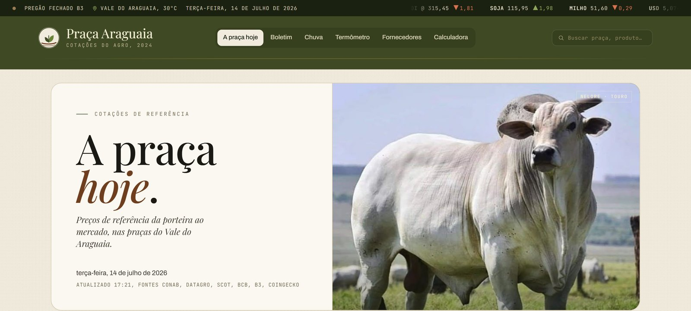
</p>

### Na porteira — o preço de cada estado, nunca uma média

<p align="center">
  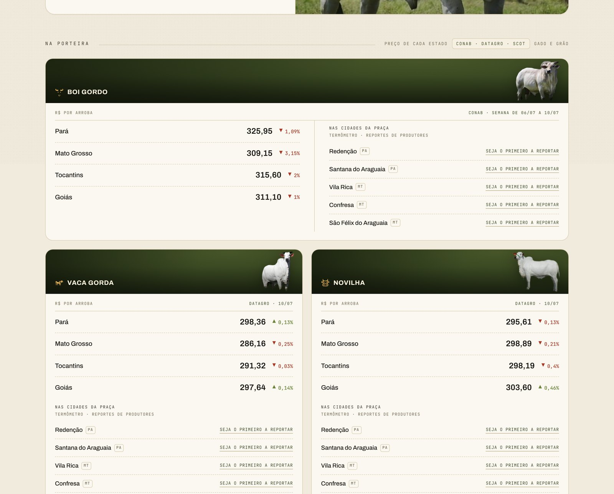
</p>

<sub>Seis categorias — **boi gordo, vaca gorda, novilha, bezerro** (arroba; o bezerro por cabeça) e **soja, milho** (saca de 60 kg). Cada card mostra o preço das quatro praças (PA, MT, TO, GO), sempre na mesma ordem, e credita **quem apurou e quando**: a CONAB fecha a semana, Datagro e Scot fecham o dia. Todos os seis trazem também o **Termômetro** — o que os produtores reportaram nas cidades, com o convite a reportar já no produto certo.</sub>

### Mercado — câmbio, ouro, bolsa e cripto

<p align="center">
  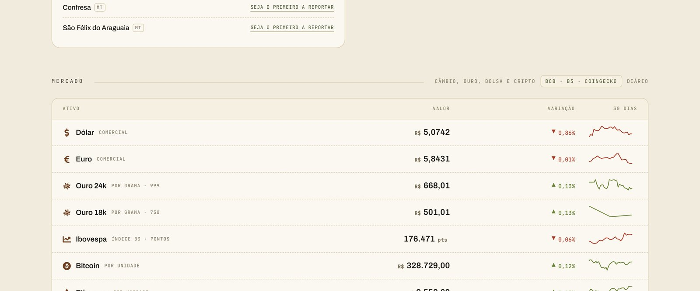
</p>

<sub>**Ouro 24k** (fino, 999) e **ouro 18k** (750) — o 18k é o mesmo grama com 75% de teor, que é a definição da liga, não uma segunda cotação. O **Ibovespa** aparece em **pontos**, sem `R$` na frente: índice não é dinheiro. Cada linha traz a mini-tendência de 30 dias.</sub>

<table>
  <tr>
    <td width="50%" valign="top">
      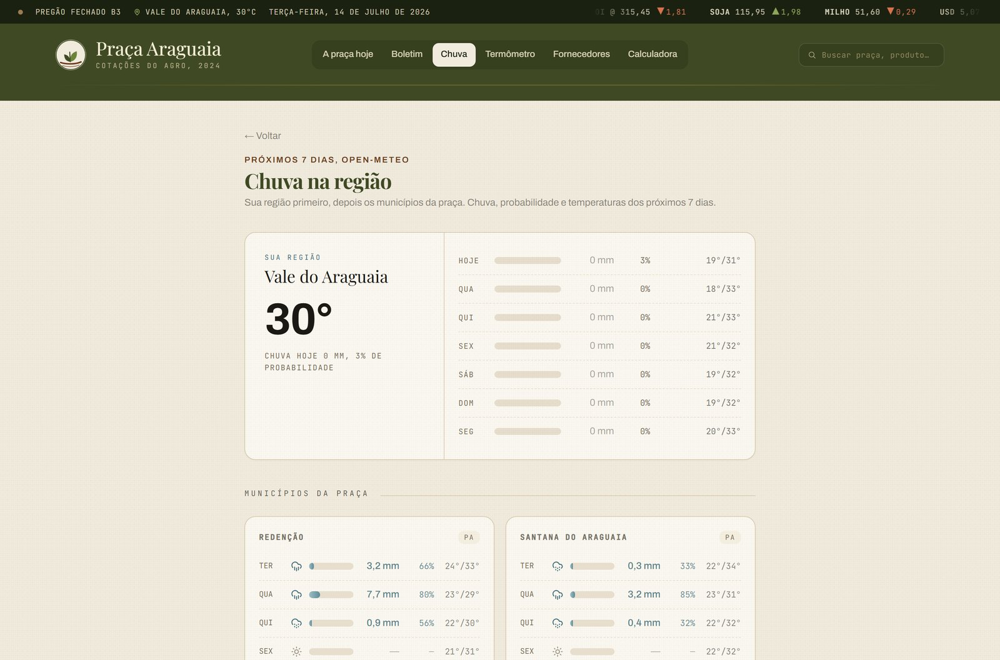<br>
      <sub><b>Chuva</b> — a sua região primeiro e depois os municípios da praça, 7 dias. Ícone por dia, volume em água e um traço no dia seco: o olho vai direto no que chove.</sub>
    </td>
    <td width="50%" valign="top">
      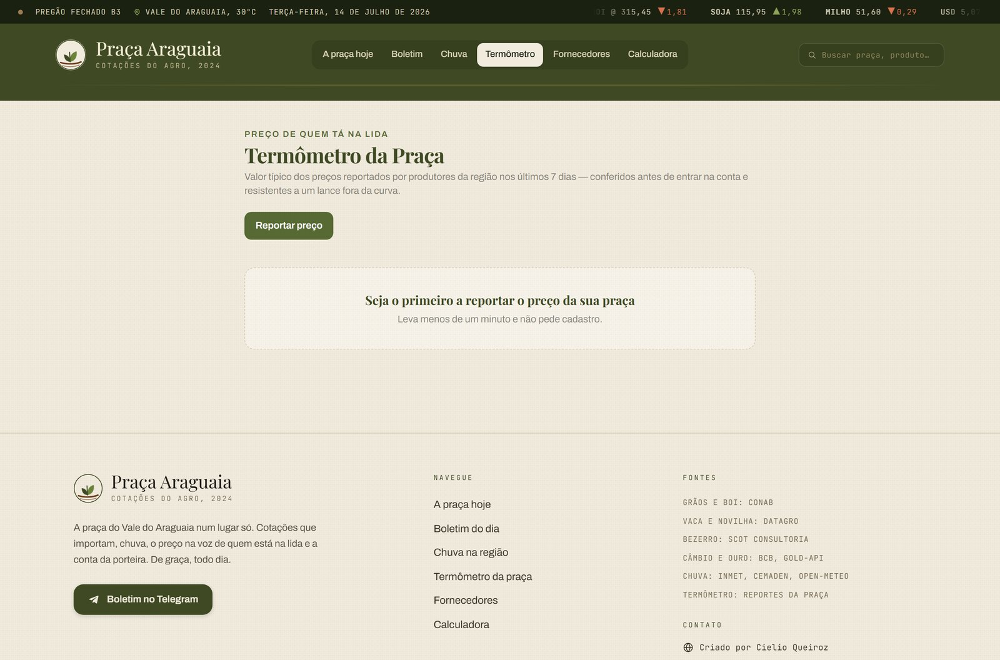<br>
      <sub><b>Termômetro</b> — o preço na voz de quem está na lida: mediana dos reportes de produtores.</sub>
    </td>
  </tr>
  <tr>
    <td width="50%" valign="top">
      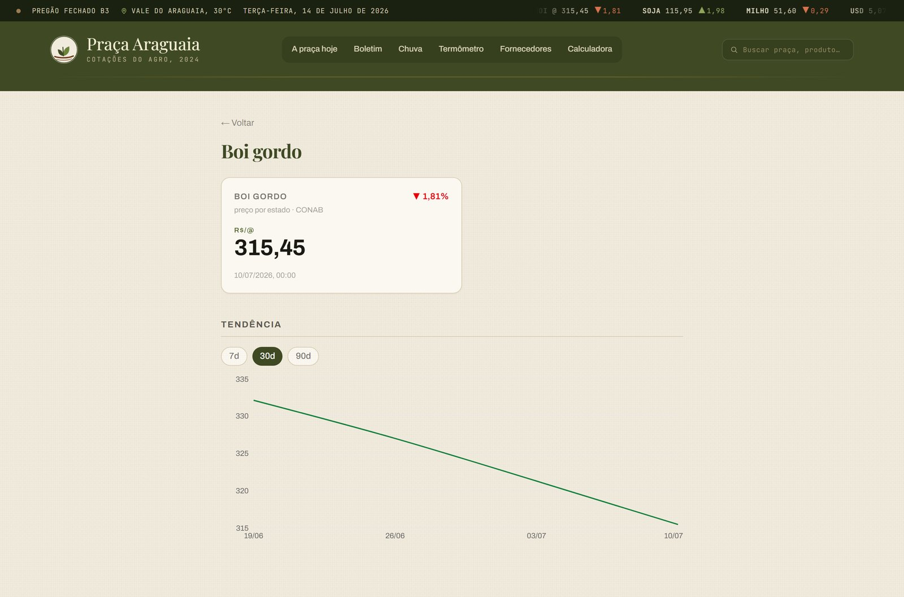<br>
      <sub><b>Tendência</b> — gráfico de cada cotação, com toggle de 7 / 30 / 90 dias.</sub>
    </td>
    <td width="50%" valign="top">
      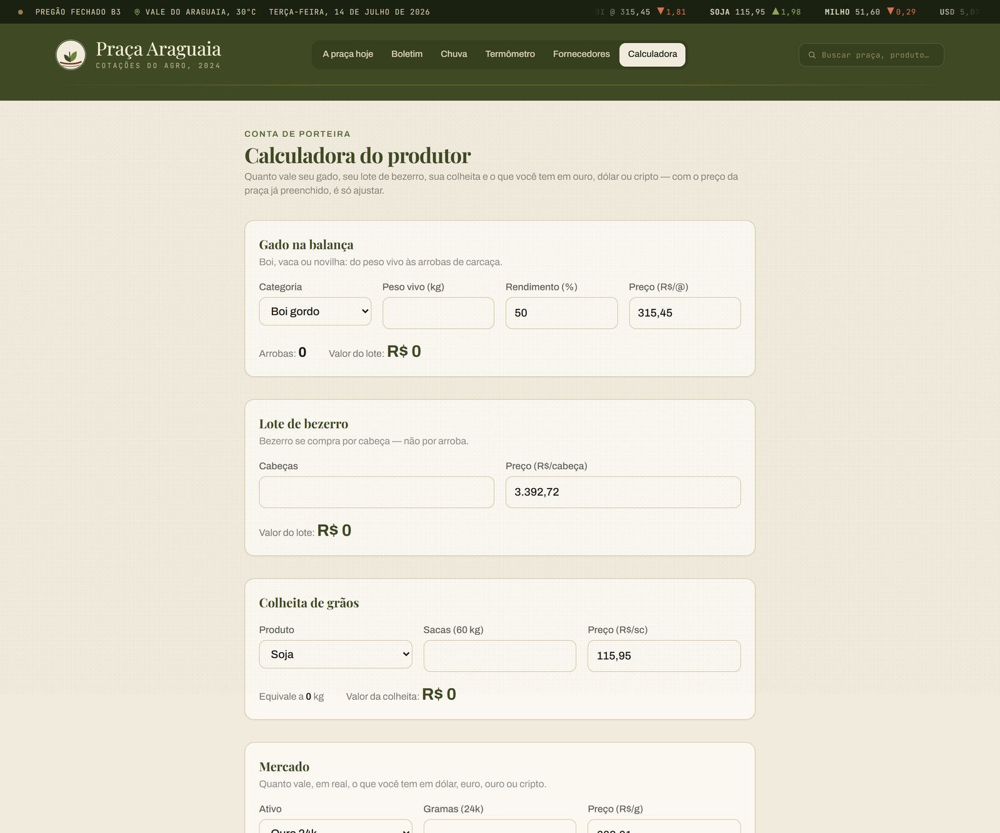<br>
      <sub><b>Calculadora</b> — gado na balança, lote de bezerro, colheita e mercado (ouro, câmbio, cripto), com o preço da praça já preenchido.</sub>
    </td>
  </tr>
</table>

### Boletim do dia e o celular

<table>
  <tr>
    <td width="34%" valign="top" align="center">
      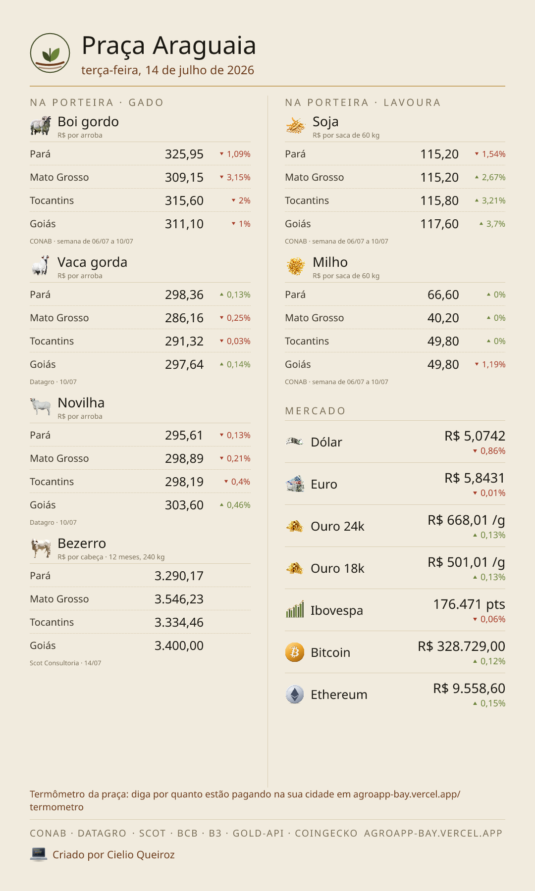<br>
      <sub><b>Boletim</b> — PNG gerado no servidor (Satori) e disparado todo dia no Telegram: gado à esquerda, lavoura e mercado à direita. A URL da foto muda a cada envio, senão o Telegram reentrega o card que já tem em cache.</sub>
    </td>
    <td width="33%" valign="top" align="center">
      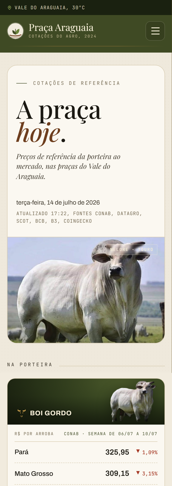<br>
      <sub><b>Mobile</b> — do celular à mesa.</sub>
    </td>
    <td width="33%" valign="top" align="center">
      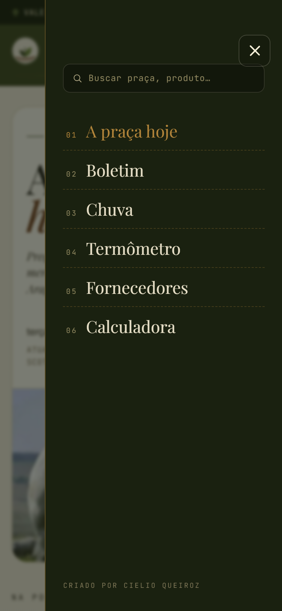<br>
      <sub><b>Menu</b> — hambúrguer e gaveta lateral abaixo de 900px.</sub>
    </td>
  </tr>
</table>

---

## O que já está no ar

| Página | O que oferece |
|---|---|
| **`/`** — a praça hoje | **Na porteira**, o preço de **cada estado** (PA/MT/TO/GO) de 6 categorias: **boi gordo, soja e milho** (CONAB), **vaca gorda e novilha** (Datagro) e **bezerro** (Scot) — cada card também mostra o que os produtores reportaram nas cidades. **No mercado**, 7 cotações com mini-tendência de 30 dias: **dólar, euro, ouro 24k, ouro 18k, Ibovespa, bitcoin e ethereum**. Topo com **ticker** e a **cidade/UF + temperatura do usuário** (geolocalização). |
| **`/cotacao/[tipo]`** | Gráfico de tendência de cada cotação, com toggle **7 / 30 / 90 dias**. |
| **`/boletim`** | Card-resumo do dia em **PNG 1080×1800** (via `next/og`/Satori) pronto para Instagram/WhatsApp, com botão de download. Enviado também no **Telegram** todo dia. |
| **`/chuva`** | **Sua região primeiro** (previsão da localização do usuário) e depois os 5 municípios da praça — chuva, probabilidade e temperatura de 7 dias (Open-Meteo). |
| **`/termometro`** | **Termômetro da Praça**: o "valor típico" (mediana) dos preços reportados por produtores nos últimos 7 dias, **nas 6 categorias da porteira**, por município, contrastado com a referência oficial. |
| **`/termometro/reportar`** | Reporte de preço **anônimo** (sem cadastro), com faixa de plausibilidade, honeypot e limite por IP. O convite no card já abre no produto certo (`?produto=`). |
| **`/fornecedores`** | Vitrine de fornecedores da praça (contato direto por WhatsApp). Qualquer um se cadastra em **`/fornecedores/anunciar`**; só entra no ar depois da moderação. |
| **`/calculadora`** | Calculadora do produtor, em quatro contas: **gado na balança** (boi, vaca ou novilha: peso vivo + rendimento → arrobas), **lote de bezerro** (por cabeça), **colheita de grãos** (sacas) e **mercado** (o que você tem em dólar, euro, ouro 24k/18k ou cripto, em reais). O preço da praça já vem preenchido. |
| **`/moderar`** | Moderação **pelo celular** (senha): abas de **preços** e **fornecedores** — aprovar/rejeitar/remover sem abrir o banco. |

Tudo apoiado em **fontes públicas e gratuitas** — sem provedores pagos e sem dados pessoais. Alertas e boletim também chegam pelo bot **[@pracaaraguaia_bot](https://t.me/pracaaraguaia_bot)** no Telegram.

### De onde vem cada preço

| Categoria | Fonte | Unidade | Ritmo |
|---|---|---|---|
| Boi gordo, soja, milho | **CONAB** (`PrecosSemanalUF.txt`, arquivo público) | @ · saca 60 kg | semanal (fecha seg–sex) |
| Vaca gorda, novilha | **Datagro** (indicador por estado) | R$/@ | diário |
| Bezerro | **Scot Consultoria** (nelore 12 meses, 240 kg) | R$/cabeça | diário |
| Dólar, euro | BCB · Frankfurter | R$ | diário |
| Ouro 24k / 18k | gold-api (onça troy) × USD-BRL | R$/g | diário |
| Ibovespa | B3, via Yahoo Finance (`^BVSP`) | pontos | diário |
| Bitcoin, ethereum | CoinGecko | R$ | diário |
| Chuva | INMET · CEMADEN · Open-Meteo | mm | diário |
| Termômetro | reportes dos próprios produtores | R$/@ | contínuo |

> **A CONAB não publica vaca, novilha nem bezerro** — o arquivo semanal por UF só traz `BOI|GORDO`. Por isso essas três vêm de indicadores de mercado, e cada card diz na cara quem apurou o preço e em que dia. O **ouro 18k não é uma segunda cotação**: é o 24k com o teor da liga (750/1000 = 75%), que é definição, não estimativa.

---

## Identidade visual

Direção **"fazenda moderna premium"** — editorial, paleta terra, sem cara de dashboard genérico.

| Elemento | Escolha |
|---|---|
| **Tipografia** | **Playfair Display** (display serifada, títulos) · **Archivo** (UI e números) · **JetBrains Mono** (dados, ticker, timestamps) — via `next/font` |
| **Paleta** | Areia (`bone` `#F1EBDE`), papel (`#FBF8F1`), oliva (`#3F4A24`), couro (`#6E3E1E`), ocre (`#B4863B`); alta em **musgo** (`#6B8339`), baixa em **tijolo** (`#A63A26`) e chuva em **água** (`#45707C`) — nunca neon |
| **Marca** | **"Broto no sulco"** — a folha nascendo da terra lavrada, num selo de osso com o anel oliva. Ela balança de leve no vento (some em `prefers-reduced-motion`) e fica parada no favicon, no card do bot e no OG. Desenho único em [`lib/marca.ts`](lib/marca.ts), consumido pelos quatro. |
| **Navegação** | Menu inline no desktop; abaixo de 900px, **hambúrguer + gaveta lateral** (fecha no Esc, no fundo e ao navegar; trava o scroll enquanto aberta) |
| **Assinatura** | Cards que abrem com a **foto do produto** (escurece e revela os dados), grão de papel sutil, filetes finos, ticker de pregão rolante e o hero com um **touro nelore no pasto** |

Os tokens vivem no `@theme` do Tailwind v4 (`app/globals.css`); os componentes do sistema estão em `components/redesign/`.

---

## Arquitetura

Duas trilhas de dados: a **coleta agendada** das cotações (cron diário) e o **fluxo de reportes** do Termômetro (anônimo, moderado). Ambas convergem no Supabase, e as páginas leem com a chave `anon` sob RLS.

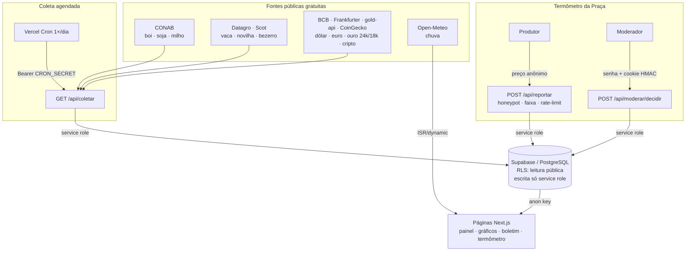

**Princípio de design:** cada fonte de cotação é desacoplada da orquestração (`lib/fontes/*` ↔ `lib/coleta.ts` via a porta `CotacaoRepo`), então adicionar uma cotação é registrar uma função — sem tocar no resto. A lógica de negócio (mediana, faixa, agregação, validação, sessão de moderação) vive em módulos **puros e testados** em `lib/`, separada da apresentação.

---

## Como foi construído

Cada funcionalidade é uma **fatia vertical fina** que percorre o ciclo completo antes da próxima começar: `brainstorming → spec → plano → implementação (TDD) → review → deploy verificado`.

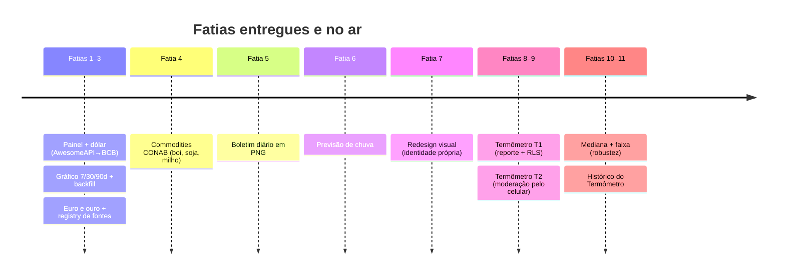

---

## Stack

| Camada | Tecnologia |
|---|---|
| Front + back | Next.js 15 (App Router), TypeScript (strict), Tailwind CSS v4 |
| Tipografia | Playfair Display · Archivo · JetBrains Mono (via `next/font`) |
| Banco / Auth | Supabase (PostgreSQL + Row Level Security) |
| Gráficos | Sparklines em SVG puro · Recharts (detalhe) |
| Imagem do boletim / OG | `next/og` (Satori) — PNG gerado no servidor |
| Geolocalização | Vercel Edge Geo (IP) + Open-Meteo (temperatura) |
| Coleta / envio agendados | Route Handlers + Vercel Cron (coleta · boletim · alertas) |
| Bot | Telegram Bot API (inscrição, boletim, alertas) |
| Testes | Vitest + Testing Library (342 testes) |
| Deploy | Vercel (auto-deploy no push, ISR, cron) |

---

## Estrutura

```
agro_app/
├─ app/
│  ├─ page.tsx                     # Painel (Na porteira / Mercado)
│  ├─ cotacao/[tipo]/page.tsx      # Detalhe + gráfico de tendência
│  ├─ boletim/page.tsx             # Card do dia + download
│  ├─ chuva/page.tsx               # Previsão de 7 dias
│  ├─ termometro/
│  │  ├─ page.tsx                  # Valor típico (mediana) por produto
│  │  ├─ reportar/page.tsx         # Reporte anônimo
│  │  └─ [produto]/page.tsx        # Histórico (gráfico) do produto
│  ├─ moderar/page.tsx             # Moderação protegida por senha
│  └─ api/
│     ├─ coletar · backfill        # Coleta/backfill (Cron/segredo)
│     ├─ boletim                   # PNG 1080×1080
│     ├─ reportar                  # Recebe reporte anônimo
│     └─ moderar/{login,decidir}   # Sessão + decisão da moderação
├─ lib/
│  ├─ fontes/*                     # Uma fonte por arquivo + registry
│  │  ├─ conab.ts                  #   boi, soja, milho (arquivo semanal por UF)
│  │  ├─ pecuaria.ts               #   vaca, novilha, bezerro (indicadores por UF)
│  │  └─ ouro.ts                   #   24k, e o 18k derivado do teor da liga
│  ├─ marca.ts · autor.ts          # Marca e assinatura (site, favicon, card, OG)
│  ├─ coleta.ts · backfill.ts      # Orquestração pura
│  ├─ termometro.ts                # Produtos, validação, mediana, faixa
│  ├─ termometro-historico.ts      # Mediana diária para o gráfico
│  ├─ moderacao.ts                 # Token HMAC, sessão, validação
│  ├─ boletim.ts · grafico.ts      # View-models puros
│  └─ supabase/{server,public,repo}.ts
├─ components/                     # Apresentação (cards, gráficos, formulários)
├─ supabase/migrations/            # DDL + RLS versionado
├─ components/redesign/            # Sistema visual novo (masthead, cards, ticker…)
├─ tests/                          # 342 testes unitários e de componente
├─ vercel.json                     # Cron diário → /api/coletar
└─ docs/superpowers/{specs,plans}/ # Spec e plano de cada fatia
```

---

## Começando

### 1. Pré-requisitos

- Node.js 18.18+ (recomendado 20+)
- Uma conta [Supabase](https://supabase.com)

### 2. Instalar

```bash
npm install
```

### 3. Banco de dados (Supabase)

Crie um projeto e aplique as migrations de [`supabase/migrations/`](supabase/migrations/) em ordem (SQL Editor do Supabase Studio, ou `supabase db push` com o projeto vinculado):

- `0001_cotacoes.sql` — tabelas `cotacoes` e `cotacoes_historico` + RLS
- `0002_*` — constraint única `(tipo, data_referencia)`
- `0003_reportes.sql` — tabela `reportes` do Termômetro + RLS

### 4. Variáveis de ambiente

```bash
cp .env.local.example .env.local
```

```bash
NEXT_PUBLIC_SUPABASE_URL=https://SEU-PROJETO.supabase.co
NEXT_PUBLIC_SUPABASE_ANON_KEY=...        # anon / publishable key
SUPABASE_SERVICE_ROLE_KEY=...            # service role — NUNCA expor no client
CRON_SECRET=...                          # segredo forte para a coleta agendada
MODERACAO_SENHA=...                      # senha da moderação em /moderar
```

> ⚠️ `SUPABASE_SERVICE_ROLE_KEY` e `MODERACAO_SENHA` são usadas **apenas no servidor**. Nunca as coloque numa variável `NEXT_PUBLIC_*`.

### 5. Rodar

```bash
npm run dev          # http://localhost:3000
```

A primeira coleta popula o painel (a tela começa vazia):

```bash
curl -H "authorization: Bearer SEU_CRON_SECRET" http://localhost:3000/api/coletar
```

---

## Scripts

| Comando | O que faz |
|---|---|
| `npm run dev` | Servidor de desenvolvimento |
| `npm run build` | Build de produção |
| `npm start` | Sobe o build |
| `npm test` | Roda os testes (Vitest) |
| `npm run test:watch` | Testes em watch mode |
| `npm run lint` | ESLint |

---

## Deploy (Vercel)

1. Conecte o repositório à Vercel — cada `git push` na `master` dispara o deploy.
2. Defina as 5 variáveis de ambiente (as mesmas do `.env.local`) no projeto, marcadas para **Production**.
3. O agendamento em [`vercel.json`](vercel.json) chama `/api/coletar` 1×/dia; a Vercel injeta `Authorization: Bearer ${CRON_SECRET}` automaticamente.

---

## Modelo de dados

```sql
cotacoes              -- último valor "vivo" por tipo (1 linha por tipo)
  tipo, valor, unidade, variacao_pct, fonte, data_referencia, atualizado_em

cotacoes_uf           -- o preço de CADA praça (PA/MT/TO/GO), 1 linha por (tipo, uf)
  tipo, uf, valor, unidade, variacao_pct, data_referencia, atualizado_em

cotacoes_historico    -- série temporal append-only (alimenta os gráficos)
  tipo, valor, fonte, data_referencia, created_at

reportes              -- Termômetro da Praça: preços reportados, moderados
  produto, municipio, valor, status (pendente/aprovado/rejeitado), ip_hash, criado_em
```

**RLS desde o início:** `SELECT` público (em `reportes`, só linhas `aprovado`); `INSERT/UPDATE/DELETE` revogados de `anon`/`authenticated` — toda escrita passa pelo service role no servidor.

---

## Roadmap

- [x] Painel de cotações + coleta diária do dólar
- [x] Gráfico de tendência (toggle 7/30/90) + backfill
- [x] Euro e ouro — coleta/backfill multi-fonte resiliente
- [x] Commodities via CONAB: boi gordo, soja, milho
- [x] Boletim diário em card PNG (Satori)
- [x] Previsão de chuva por município
- [x] Redesign com identidade visual própria
- [x] Termômetro da Praça: reporte anônimo + moderação pelo celular
- [x] Mediana + faixa (robustez) e histórico do Termômetro
- [x] Calculadora do produtor (lote de boi + colheita)
- [x] Bot de Telegram: inscrição, boletim diário e alertas de movimento (gratuito)
- [x] Vitrine de fornecedores com submissão pública + moderação
- [x] Redesign "fazenda moderna premium" + geolocalização do usuário
- [x] Menu hambúrguer no celular + marca nova ("broto no sulco") em site, favicon, card e OG
- [x] Porteira completa: **vaca gorda, novilha e bezerro** (Datagro/Scot), além do boi
- [x] **Ouro 24k e 18k** e **Ibovespa** no mercado
- [x] Termômetro nas **6 categorias** da porteira (antes só o boi)
- [x] Calculadora com gado, bezerro, colheita e mercado (ouro, câmbio, cripto)
- [ ] Verificação do produtor (OTP) e reputação — *dependem de provedor pago; em avaliação*

Cada fatia segue o ciclo spec → plano → implementação, documentado em [`docs/superpowers/`](docs/superpowers/).

---

## Licença

Projeto privado. Todos os direitos reservados.
