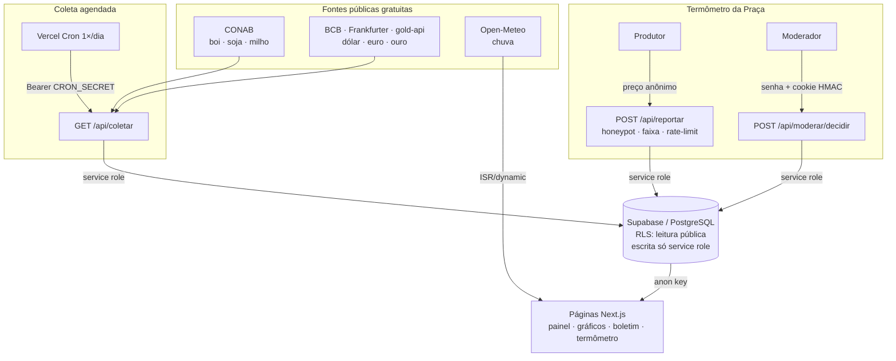
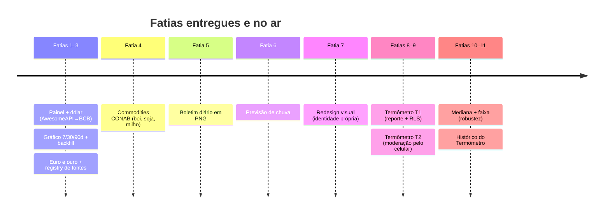

# Praça Araguaia 🌾

> Fonte diária de informação do produtor rural da região do Araguaia (sul do PA / nordeste do MT): cotações que importam, o preço da praça na voz de quem está na lida, chuva e boletim — tudo grátis, atualizado todo dia.

<p>
  
  
  
  
  
  
</p>

Plataforma de **informação agropecuária** da região do Araguaia. No ar em **[agroapp-bay.vercel.app](https://agroapp-bay.vercel.app)** com seis cotações, boletim diário, previsão de chuva e o **Termômetro da Praça** — construída em fatias verticais finas, cada uma com spec, plano, testes e deploy verificado.

- 🟢 **Estado atual e ponto de retomada:** [`ESTADO-DO-PROJETO.md`](ESTADO-DO-PROJETO.md)
- 📄 Conceito completo do produto: [`conceito-praca-araguaia.md`](conceito-praca-araguaia.md)
- 🧭 Specs e planos de cada fatia: [`docs/superpowers/`](docs/superpowers/)

---

## O que já está no ar

| Página | O que oferece |
|---|---|
| **`/`** — painel | Seis cotações: **boi gordo, soja, milho** (CONAB) + **dólar, euro, ouro** (câmbio/mercado), agrupadas em "Na porteira" e "Mercado", com variação e selo de "desatualizado" por tipo. |
| **`/cotacao/[tipo]`** | Gráfico de tendência de cada cotação, com toggle **7 / 30 / 90 dias**. |
| **`/boletim`** | Card-resumo do dia em **PNG 1080×1080** (via `next/og`/Satori) pronto para Instagram/WhatsApp, com botão de download. |
| **`/chuva`** | Previsão de **7 dias** (chuva, probabilidade, temperatura) para 5 municípios da praça, via Open-Meteo. |
| **`/termometro`** | **Termômetro da Praça**: o "valor típico" (mediana) dos preços reportados por produtores nos últimos 7 dias, por produto e município, contrastado com a referência CONAB. |
| **`/termometro/reportar`** | Reporte de preço **anônimo** (sem cadastro), com faixa de plausibilidade, honeypot e limite por IP. |
| **`/termometro/[produto]`** | Histórico da praça: gráfico da tendência da **mediana diária** do produto. |
| **`/moderar`** | Moderação da fila de reportes **pelo celular**, protegida por senha (aprovar/rejeitar sem abrir o banco). |

Tudo apoiado em **fontes públicas e gratuitas** (CONAB, BCB, Frankfurter, gold-api, Open-Meteo) — sem provedores pagos e sem dados pessoais.

---

## Arquitetura

Duas trilhas de dados: a **coleta agendada** das cotações (cron diário) e o **fluxo de reportes** do Termômetro (anônimo, moderado). Ambas convergem no Supabase, e as páginas leem com a chave `anon` sob RLS.



**Princípio de design:** cada fonte de cotação é desacoplada da orquestração (`lib/fontes/*` ↔ `lib/coleta.ts` via a porta `CotacaoRepo`), então adicionar uma cotação é registrar uma função — sem tocar no resto. A lógica de negócio (mediana, faixa, agregação, validação, sessão de moderação) vive em módulos **puros e testados** em `lib/`, separada da apresentação.

---

## Como foi construído

Cada funcionalidade é uma **fatia vertical fina** que percorre o ciclo completo antes da próxima começar: `brainstorming → spec → plano → implementação (TDD) → review → deploy verificado`.



---

## Stack

| Camada | Tecnologia |
|---|---|
| Front + back | Next.js 15 (App Router), TypeScript (strict), Tailwind CSS v4 |
| Banco / Auth | Supabase (PostgreSQL + Row Level Security) |
| Gráficos | Recharts (via shadcn/ui Chart) |
| Imagem do boletim | `next/og` (Satori) — PNG gerado no servidor |
| Coleta agendada | Route Handler + Vercel Cron |
| Testes | Vitest + Testing Library (177 testes) |
| Deploy | Vercel (auto-deploy no push, ISR, cron) |

---

## Estrutura

```
agro_app/
├─ app/
│  ├─ page.tsx                     # Painel (Na porteira / Mercado)
│  ├─ cotacao/[tipo]/page.tsx      # Detalhe + gráfico de tendência
│  ├─ boletim/page.tsx             # Card do dia + download
│  ├─ chuva/page.tsx               # Previsão de 7 dias
│  ├─ termometro/
│  │  ├─ page.tsx                  # Valor típico (mediana) por produto
│  │  ├─ reportar/page.tsx         # Reporte anônimo
│  │  └─ [produto]/page.tsx        # Histórico (gráfico) do produto
│  ├─ moderar/page.tsx             # Moderação protegida por senha
│  └─ api/
│     ├─ coletar · backfill        # Coleta/backfill (Cron/segredo)
│     ├─ boletim                   # PNG 1080×1080
│     ├─ reportar                  # Recebe reporte anônimo
│     └─ moderar/{login,decidir}   # Sessão + decisão da moderação
├─ lib/
│  ├─ fontes/*                     # Uma fonte por arquivo + registry
│  ├─ coleta.ts · backfill.ts      # Orquestração pura
│  ├─ termometro.ts                # Produtos, validação, mediana, faixa
│  ├─ termometro-historico.ts      # Mediana diária para o gráfico
│  ├─ moderacao.ts                 # Token HMAC, sessão, validação
│  ├─ boletim.ts · grafico.ts      # View-models puros
│  └─ supabase/{server,public,repo}.ts
├─ components/                     # Apresentação (cards, gráficos, formulários)
├─ supabase/migrations/            # DDL + RLS versionado
├─ tests/                          # 177 testes unitários e de componente
├─ vercel.json                     # Cron diário → /api/coletar
└─ docs/superpowers/{specs,plans}/ # Spec e plano de cada fatia
```

---

## Começando

### 1. Pré-requisitos

- Node.js 18.18+ (recomendado 20+)
- Uma conta [Supabase](https://supabase.com)

### 2. Instalar

```bash
npm install
```

### 3. Banco de dados (Supabase)

Crie um projeto e aplique as migrations de [`supabase/migrations/`](supabase/migrations/) em ordem (SQL Editor do Supabase Studio, ou `supabase db push` com o projeto vinculado):

- `0001_cotacoes.sql` — tabelas `cotacoes` e `cotacoes_historico` + RLS
- `0002_*` — constraint única `(tipo, data_referencia)`
- `0003_reportes.sql` — tabela `reportes` do Termômetro + RLS

### 4. Variáveis de ambiente

```bash
cp .env.local.example .env.local
```

```bash
NEXT_PUBLIC_SUPABASE_URL=https://SEU-PROJETO.supabase.co
NEXT_PUBLIC_SUPABASE_ANON_KEY=...        # anon / publishable key
SUPABASE_SERVICE_ROLE_KEY=...            # service role — NUNCA expor no client
CRON_SECRET=...                          # segredo forte para a coleta agendada
MODERACAO_SENHA=...                      # senha da moderação em /moderar
```

> ⚠️ `SUPABASE_SERVICE_ROLE_KEY` e `MODERACAO_SENHA` são usadas **apenas no servidor**. Nunca as coloque numa variável `NEXT_PUBLIC_*`.

### 5. Rodar

```bash
npm run dev          # http://localhost:3000
```

A primeira coleta popula o painel (a tela começa vazia):

```bash
curl -H "authorization: Bearer SEU_CRON_SECRET" http://localhost:3000/api/coletar
```

---

## Scripts

| Comando | O que faz |
|---|---|
| `npm run dev` | Servidor de desenvolvimento |
| `npm run build` | Build de produção |
| `npm start` | Sobe o build |
| `npm test` | Roda os testes (Vitest) |
| `npm run test:watch` | Testes em watch mode |
| `npm run lint` | ESLint |

---

## Deploy (Vercel)

1. Conecte o repositório à Vercel — cada `git push` na `master` dispara o deploy.
2. Defina as 5 variáveis de ambiente (as mesmas do `.env.local`) no projeto, marcadas para **Production**.
3. O agendamento em [`vercel.json`](vercel.json) chama `/api/coletar` 1×/dia; a Vercel injeta `Authorization: Bearer ${CRON_SECRET}` automaticamente.

---

## Modelo de dados

```sql
cotacoes              -- último valor "vivo" por tipo (1 linha por tipo)
  tipo, valor, unidade, variacao_pct, fonte, data_referencia, atualizado_em

cotacoes_historico    -- série temporal append-only (alimenta os gráficos)
  tipo, valor, fonte, data_referencia, created_at

reportes              -- Termômetro da Praça: preços reportados, moderados
  produto, municipio, valor, status (pendente/aprovado/rejeitado), ip_hash, criado_em
```

**RLS desde o início:** `SELECT` público (em `reportes`, só linhas `aprovado`); `INSERT/UPDATE/DELETE` revogados de `anon`/`authenticated` — toda escrita passa pelo service role no servidor.

---

## Roadmap

- [x] Painel de cotações + coleta diária do dólar
- [x] Gráfico de tendência (toggle 7/30/90) + backfill
- [x] Euro e ouro — coleta/backfill multi-fonte resiliente
- [x] Commodities via CONAB: boi gordo, soja, milho
- [x] Boletim diário em card PNG (Satori)
- [x] Previsão de chuva por município
- [x] Redesign com identidade visual própria
- [x] Termômetro da Praça: reporte anônimo + moderação pelo celular
- [x] Mediana + faixa (robustez) e histórico do Termômetro
- [ ] Verificação do produtor (OTP) e reputação — *dependem de provedor pago; em avaliação*
- [ ] Vitrine de insumos e fornecedores
- [ ] Alertas e boletim por bot de Telegram (gratuito)

Cada fatia segue o ciclo spec → plano → implementação, documentado em [`docs/superpowers/`](docs/superpowers/).

---

## Licença

Projeto privado. Todos os direitos reservados.
