# Praça Araguaia 🌾

> Fonte diária de informação do produtor rural da região do Araguaia (sul do PA / nordeste do MT): cotações que importam, o preço da praça na voz de quem está na lida, chuva e boletim — tudo grátis, atualizado todo dia.

<p>
  
  
  
  
  
  
</p>

Plataforma de **informação agropecuária** da região do Araguaia. No ar em **[agroapp-bay.vercel.app](https://agroapp-bay.vercel.app)** com **12 cotações** (gado, grão, câmbio, ouro, bolsa e cripto), boletim diário, previsão de chuva e o **Termômetro da Praça** — construída em fatias verticais finas, cada uma com spec, plano, testes e deploy verificado.

- 🟢 **Estado atual e ponto de retomada:** [`ESTADO-DO-PROJETO.md`](ESTADO-DO-PROJETO.md)
- 📄 Conceito completo do produto: [`conceito-praca-araguaia.md`](conceito-praca-araguaia.md)
- 🧭 Specs e planos de cada fatia: [`docs/superpowers/`](docs/superpowers/)

---

## Prévia

<p align="center">
  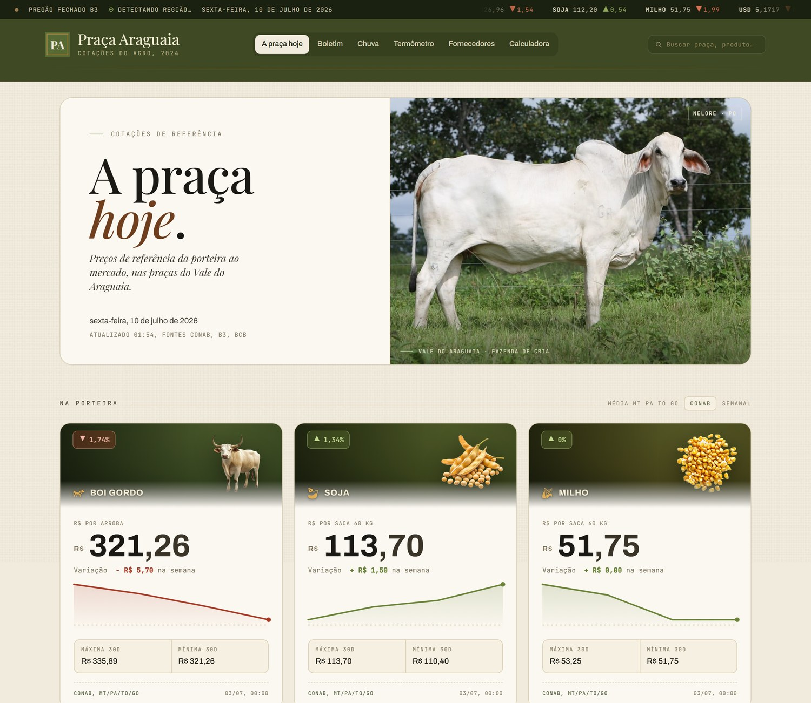
</p>

### Na porteira — o preço de cada praça, nunca uma média

<p align="center">
  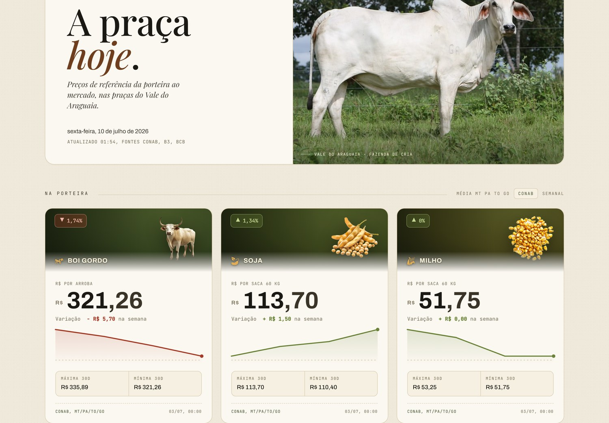
</p>

<sub>Seis categorias — **boi gordo, vaca gorda, novilha, bezerro** (arroba; o bezerro por cabeça) e **soja, milho** (saca de 60 kg) — em cards de mesmo tamanho, lado a lado: preços em cima, Termômetro embaixo. **Boi e vaca** trazem as três cidades do Pará (Marabá, Paragominas, Redenção) e **uma linha por estado** (Mato Grosso, Tocantins, Goiás, Bahia, Maranhão), com o valor da praça de referência da **Scot** mais próxima do Araguaia. Cada card credita **quem apurou e quando**: a CONAB fecha a semana, a Scot fecha o dia. O **Termômetro** traz o que os produtores reportaram nas cidades, com o convite a reportar já no produto certo.</sub>

### Mercado — dólar, ouro e bolsa

<p align="center">
  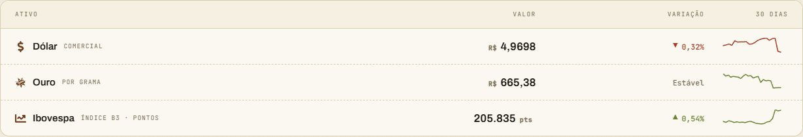
</p>

<sub>O **Ouro** aparece em **R$ por grama** (metal fino, 999) — a cotação de mercado. O **Ibovespa** aparece em **pontos**, sem `R$` na frente: índice não é dinheiro. Cada linha traz a mini-tendência de 30 dias.</sub>

<table>
  <tr>
    <td width="50%" valign="top">
      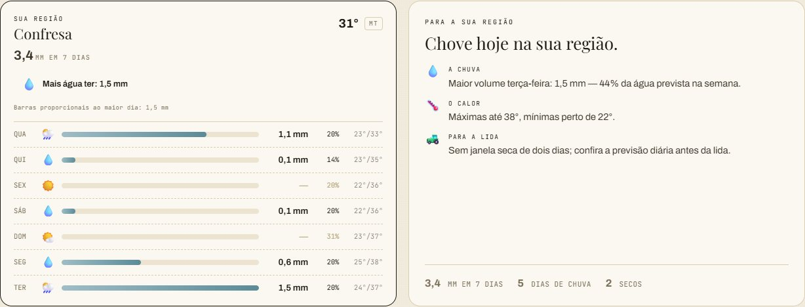<br>
      <sub><b>Chuva</b> — a sua região primeiro e depois os municípios da praça, 7 dias. Ícone por dia, volume em água e um traço no dia seco: o olho vai direto no que chove.</sub>
    </td>
    <td width="50%" valign="top">
      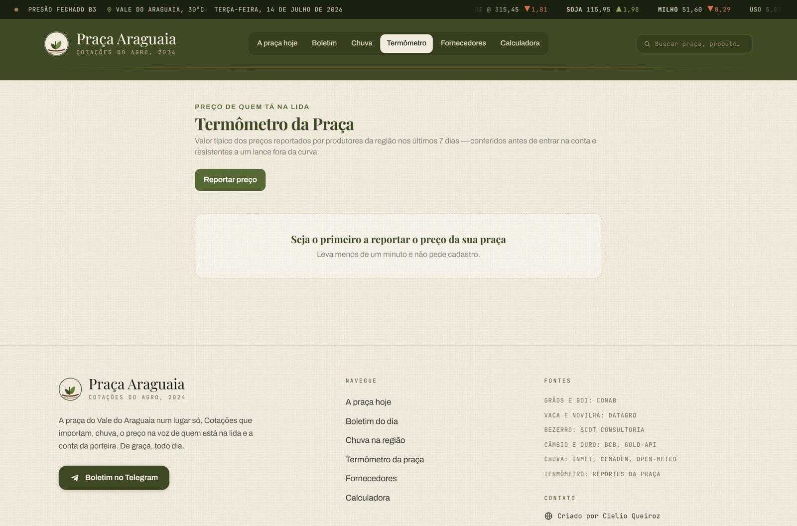<br>
      <sub><b>Termômetro</b> — o preço na voz de quem está na lida: mediana dos reportes de produtores.</sub>
    </td>
  </tr>
  <tr>
    <td width="50%" valign="top">
      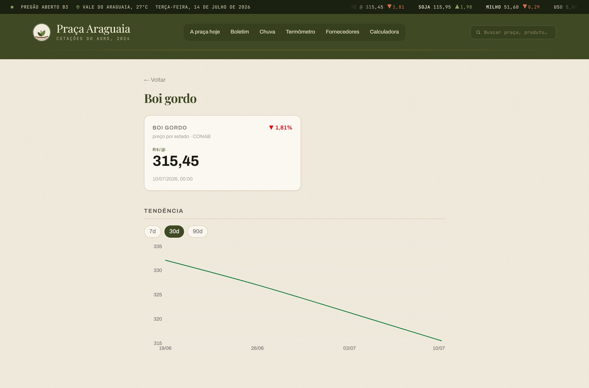<br>
      <sub><b>Tendência</b> — gráfico de cada cotação, com toggle de 7 / 30 / 90 dias.</sub>
    </td>
    <td width="50%" valign="top">
      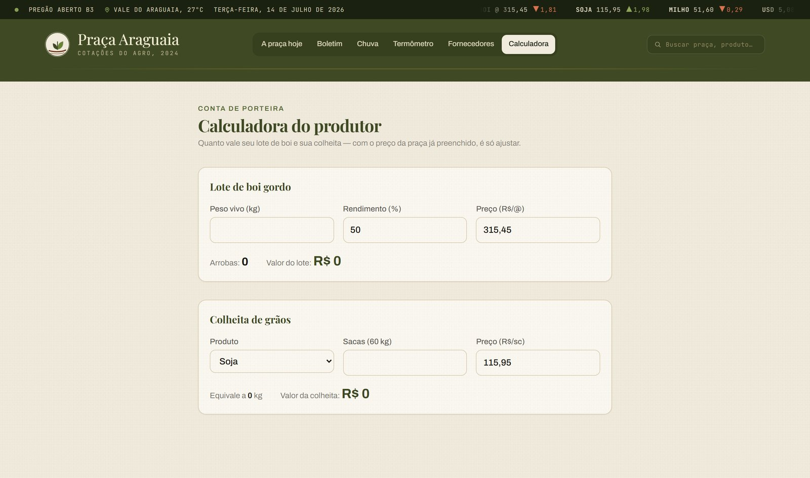<br>
      <sub><b>Calculadora</b> — gado na balança, lote de bezerro, colheita e mercado (ouro, câmbio, cripto), com o preço da praça já preenchido.</sub>
    </td>
  </tr>
</table>

### Boletim do dia e o celular

<table>
  <tr>
    <td width="34%" valign="top" align="center">
      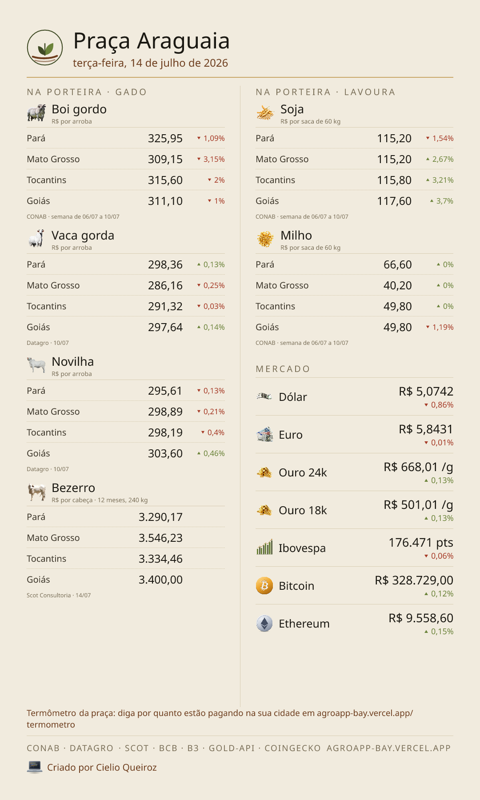<br>
      <sub><b>Boletim</b> — PNG gerado no servidor (Satori), pronto para baixar e compartilhar: gado à esquerda, lavoura e mercado à direita. O fechamento é enviado pelo Telegram em dias úteis, depois da coleta completa.</sub>
    </td>
    <td width="33%" valign="top" align="center">
      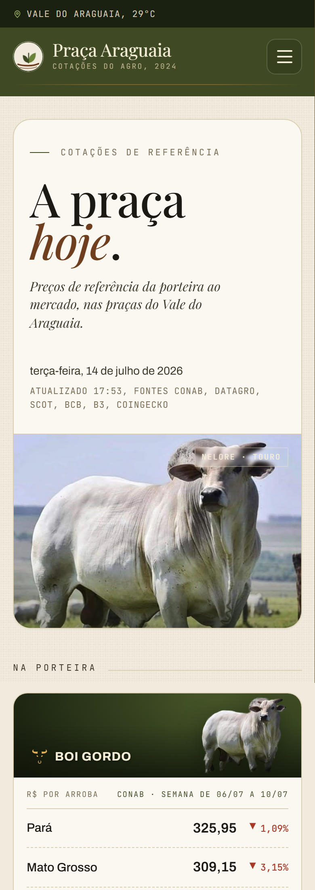<br>
      <sub><b>Mobile</b> — do celular à mesa.</sub>
    </td>
    <td width="33%" valign="top" align="center">
      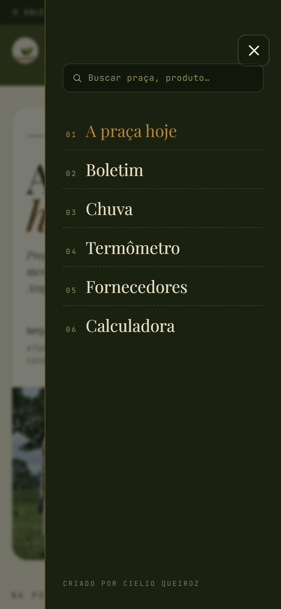<br>
      <sub><b>Menu</b> — hambúrguer e gaveta lateral abaixo de 900px.</sub>
    </td>
  </tr>
</table>

---

## O que já está no ar

| Página | O que oferece |
|---|---|
| **`/`** — Notícias do Mercado | Home com as **notícias** do agro/pecuária/mercado, agregadas de 8 veículos (RSS), com foto e seção por assunto. O ticker de preços fica no topo de todas as páginas. |
| **`/cotacoes`** — a praça hoje | **Na porteira**, 6 categorias: **boi e vaca** pela **Scot** (3 cidades do PA + uma praça de referência por estado — MT, TO, GO, BA, MA), **novilha e bezerro** (Scot, reposição por estado) e **soja e milho** (CONAB, por estado) — cada card também mostra o que os produtores reportaram nas cidades. **No mercado**, 3 cotações com mini-tendência de 30 dias: **dólar, ouro (R$/g) e Ibovespa**. Topo com **ticker** e a **cidade/UF + temperatura do usuário** (geolocalização). |
| **`/cotacao/[tipo]`** | Gráfico de tendência de cada cotação, com toggle **7 / 30 / 90 dias**. |
| **`/boletim`** | Card-resumo em **PNG 1080×1200** para Telegram/WhatsApp e versão completa 1080×2300 (via `next/og`/Satori). O fechamento é enviado após coleta completa em dia útil. |
| **`/chuva`** | **Sua região primeiro** (previsão da localização do usuário) e depois os 5 municípios da praça — chuva, probabilidade e temperatura de 7 dias (Open-Meteo). O card da sua região é **o mesmo componente** dos municípios: uma linha de dia lida do mesmo jeito em todos. |
| **`/termometro`** | **Termômetro da Praça**: o "valor típico" (mediana) dos preços reportados por produtores nos últimos 7 dias, **nas 6 categorias da porteira**, por município, contrastado com a referência oficial. |
| **`/termometro/reportar`** | Reporte de preço **anônimo** (sem cadastro), com faixa de plausibilidade, honeypot e limite por IP. O convite no card já abre no produto certo (`?produto=`). |
| **`/fornecedores`** | Vitrine de fornecedores da praça (contato direto por WhatsApp). Qualquer um se cadastra em **`/fornecedores/anunciar`**; só entra no ar depois da moderação. |
| **`/calculadora`** | Calculadora do produtor, em quatro contas: **gado na balança** (boi, vaca ou novilha: peso vivo + rendimento → arrobas), **lote de bezerro** (por cabeça), **colheita de grãos** (sacas) e **mercado** (o que você tem em dólar, euro, ouro ou cripto, em reais). O preço da praça já vem preenchido. |
| **`/moderar`** | Moderação **pelo celular** (senha): abas de **preços** e **fornecedores** — aprovar/rejeitar/remover sem abrir o banco. |

Tudo apoiado em **fontes públicas e gratuitas** — sem provedores pagos. O bot **[@pracaaraguaia_bot](https://t.me/pracaaraguaia_bot)** recebe inscrições. Os crons ativos são a coleta de preços e o boletim de fechamento; alertas e resumo de audiência seguem sem envio automático.

### De onde vem cada preço

| Categoria | Fonte | Unidade | Ritmo |
|---|---|---|---|
| Boi gordo, vaca gorda | **Scot Consultoria** — praça a praça (3 cidades do PA + praça de referência de MT/TO/GO/BA/MA) | R$/@ | diário |
| Novilha, bezerro | **Scot Consultoria** — reposição por estado | R$/cabeça | diário |
| Soja, milho | **CONAB** (`PrecosSemanalUF.txt`, arquivo público) | saca 60 kg | semanal (fecha seg–sex) |
| Dólar, euro | BCB · Frankfurter | R$ | diário |
| Ouro | gold-api (onça troy) × USD-BRL | R$/g | diário |
| Ibovespa | B3, via Yahoo Finance (`^BVSP`) | pontos | diário |
| Bitcoin, ethereum | CoinGecko | R$ | diário |
| Chuva | INMET · CEMADEN · Open-Meteo | mm | diário |
| Termômetro | reportes dos próprios produtores | R$/@ | contínuo |

> **A CONAB só publica boi/soja/milho por estado** (`BOI|GORDO`, sem vaca/novilha/bezerro), e por estado a granularidade some — o produtor negocia na praça, não no "preço do Pará". Por isso **boi e vaca vêm da Scot, praça a praça**: as três cidades do Pará e uma linha de referência por estado vizinho. **Novilha e bezerro** são reposição (também Scot). Cada card diz na cara quem apurou o preço e em que dia.

---

## Identidade visual

Direção **"fazenda moderna premium"** — editorial, paleta terra, sem cara de dashboard genérico.

| Elemento | Escolha |
|---|---|
| **Tipografia** | **Playfair Display** (display serifada, títulos) · **Archivo** (UI e números) · **JetBrains Mono** (dados, ticker, timestamps) — via `next/font` |
| **Paleta** | Areia (`bone` `#F1EBDE`), papel (`#FBF8F1`), oliva (`#3F4A24`), couro (`#6E3E1E`), ocre (`#B4863B`); alta em **musgo** (`#6B8339`), baixa em **tijolo** (`#A63A26`) e chuva em **água** (`#45707C`) — nunca neon |
| **Marca** | **"Broto no sulco"** — a folha nascendo da terra lavrada, num selo de osso com o anel oliva. Ela balança de leve no vento (some em `prefers-reduced-motion`) e fica parada no favicon, no card do bot e no OG. Desenho único em [`lib/marca.ts`](lib/marca.ts), consumido pelos quatro. |
| **Navegação** | Menu inline no desktop; abaixo de 900px, **hambúrguer + gaveta lateral** (fecha no Esc, no fundo e ao navegar; trava o scroll enquanto aberta) |
| **Assinatura** | Cards que abrem com a **foto do produto** (escurece e revela os dados), grão de papel sutil, filetes finos, ticker de pregão rolante e o hero com um **touro nelore no pasto** |

Os tokens vivem no `@theme` do Tailwind v4 (`app/globals.css`); cada componente mora à distância de quem o usa (ver `AGENTS.md`).

---

## Arquitetura

Duas trilhas de dados: a **coleta agendada** das cotações (cron diário) e o **fluxo de reportes** do Termômetro (anônimo, moderado). Ambas convergem no Neon PostgreSQL. As páginas usam uma conexão SQL só de leitura, sob RLS; as rotas de escrita usam a conexão de servidor.

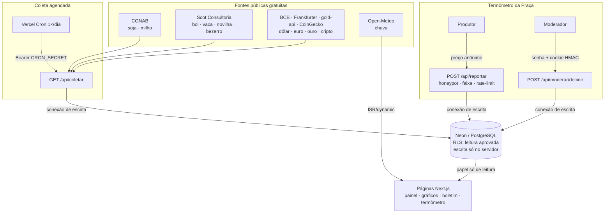
```mermaid
flowchart TD
    subgraph Fontes["Fontes públicas gratuitas"]
        CONAB["CONAB<br/>soja · milho"]
        GADO["Scot Consultoria<br/>boi · vaca · novilha · bezerro"]
        CAMBIO["BCB · Frankfurter · gold-api · CoinGecko<br/>dólar · euro · ouro · cripto"]
        METEO["Open-Meteo<br/>chuva"]
    end

    subgraph Coleta["Coleta agendada"]
        CRON["Vercel Cron 1×/dia"] -->|Bearer CRON_SECRET| COLETAR["GET /api/coletar"]
        CONAB --> COLETAR
        GADO --> COLETAR
        CAMBIO --> COLETAR
    end

    subgraph Reportes["Termômetro da Praça"]
        PROD["Produtor"] -->|preço anônimo| REPORTAR["POST /api/reportar<br/>honeypot · faixa · rate-limit"]
        MOD["Moderador"] -->|senha + cookie HMAC| DECIDIR["POST /api/moderar/decidir"]
    end

    COLETAR -->|conexão de escrita| DB[("Neon / PostgreSQL<br/>RLS: leitura aprovada<br/>escrita só no servidor")]
    REPORTAR -->|conexão de escrita| DB
    DECIDIR -->|conexão de escrita| DB

    DB -->|papel só de leitura| PAGES["Páginas Next.js<br/>painel · gráficos · boletim · termômetro"]
    METEO -->|ISR/dynamic| PAGES
```

**Princípio de design:** cada fonte de cotação é desacoplada da orquestração (`lib/fontes/*` ↔ `lib/coleta.ts` via a porta `CotacaoRepo`), então adicionar uma cotação é registrar uma função — sem tocar no resto. A lógica de negócio (mediana, faixa, agregação, validação, sessão de moderação) vive em módulos **puros e testados** em `lib/`, separada da apresentação.

---

## Como foi construído

Cada funcionalidade é uma **fatia vertical fina** que percorre o ciclo completo antes da próxima começar: `brainstorming → spec → plano → implementação (TDD) → review → deploy verificado`.

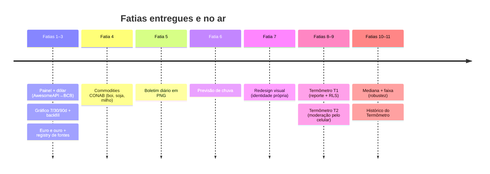
```mermaid
timeline
    title Fatias entregues e no ar
    Fatias 1–3 : Painel + dólar (AwesomeAPI→BCB) : Gráfico 7/30/90d + backfill : Euro e ouro + registry de fontes
    Fatia 4 : Commodities CONAB (boi, soja, milho)
    Fatia 5 : Boletim diário em PNG
    Fatia 6 : Previsão de chuva
    Fatia 7 : Redesign visual (identidade própria)
    Fatias 8–9 : Termômetro T1 (reporte + RLS) : Termômetro T2 (moderação pelo celular)
    Fatias 10–11 : Mediana + faixa (robustez) : Histórico do Termômetro
```

---

## Stack

| Camada | Tecnologia |
|---|---|
| Front + back | Next.js 15 (App Router), TypeScript (strict), Tailwind CSS v4 |
| Tipografia | Playfair Display · Archivo · JetBrains Mono (via `next/font`) |
| Banco / Auth | Neon PostgreSQL + papel de leitura sob RLS; moderação por cookie assinado |
| Gráficos | Sparklines em SVG puro · Recharts (detalhe) |
| Imagem do boletim / OG | `next/og` (Satori) — PNG gerado no servidor |
| Geolocalização | Vercel Edge Geo (IP) + Open-Meteo (temperatura) |
| Coleta agendada | Route Handlers + Vercel Cron (coleta e boletim de fechamento) |
| Bot | Telegram Bot API (inscrição e boletim de fechamento ativos; alertas sem cron) |
| Testes | Vitest + Testing Library |
| Deploy | Vercel (auto-deploy no push, ISR, cron) |

---

## Estrutura

```
agro_app/
├─ app/                            # Pasta com _ não vira rota (private folder do Next)
│  ├─ layout.tsx                   # Casca, metadata padrão e cromo — nada mais
│  ├─ _chrome/                     # Masthead, ticker, rodapé, busca: só o layout usa
│  ├─ page.tsx · _home/            # Home (notícias) e o que só ela usa
│  ├─ cotacao/[tipo]/page.tsx      # Detalhe + gráfico de tendência
│  ├─ boletim/page.tsx             # Card do dia + download
│  ├─ chuva/                       # Previsão de 7 dias + _components/
│  ├─ termometro/
│  │  ├─ page.tsx                  # Valor típico (mediana) por produto
│  │  ├─ _components/              # Usado pela subárvore do termômetro
│  │  ├─ reportar/page.tsx         # Reporte anônimo
│  │  └─ [produto]/page.tsx        # Histórico (gráfico) do produto
│  ├─ moderar/page.tsx             # Moderação protegida por senha
│  └─ api/
│     ├─ coletar · backfill        # Coleta/backfill (Cron/segredo)
│     ├─ boletim                   # PNG compacto 1080×1200 e completo 1080×2300
│     ├─ reportar                  # Recebe reporte anônimo
│     └─ moderar/{login,decidir}   # Sessão + decisão da moderação
├─ lib/
│  ├─ fontes/*                     # Uma fonte por arquivo + registry
│  │  ├─ conab.ts                  #   soja, milho (arquivo semanal por UF)
│  │  ├─ scot.ts                   #   boi, vaca (praça a praça: cidades do PA + estados)
│  │  ├─ pecuaria.ts               #   novilha, bezerro (reposição por UF)
│  │  └─ ouro.ts                   #   ouro fino em R$/g (onça troy × USD-BRL)
│  ├─ marca.ts · autor.ts          # Marca e assinatura (site, favicon, card, OG)
│  ├─ coleta.ts · backfill.ts      # Orquestração pura
│  ├─ termometro.ts                # Produtos, validação, mediana, faixa
│  ├─ termometro-historico.ts      # Mediana diária para o gráfico
│  ├─ moderacao.ts                 # Token HMAC, sessão, validação
│  ├─ boletim.ts · grafico.ts      # View-models puros
│  ├─ formato.ts                   # Número e data em pt-BR (nunca `new Intl` na página)
│  └─ supabase/{server,public,repo}.ts
├─ components/                     # Só o compartilhado por 2+ rotas (+ ui/ do shadcn)
├─ supabase/migrations/            # DDL + RLS versionado
├─ tests/                          # testes unitários, de rota e de componente
├─ vercel.json                     # Cron diário → /api/coletar
└─ docs/superpowers/{specs,plans}/ # Spec e plano de cada fatia
```

---

## Começando

### 1. Pré-requisitos

- Node.js 18.18+ (recomendado 20+)
- Uma conta [Neon](https://neon.com)

### 2. Instalar

```bash
npm install
```

### 3. Banco de dados (Neon)

Crie um projeto PostgreSQL no Neon e configure `DATABASE_URL_UNPOOLED` para a preparação inicial. Execute `node scripts/preparar-neon.mjs`: ele aplica [`neon/migrations/0001_schema_inicial.sql`](neon/migrations/0001_schema_inicial.sql), cria um papel de leitura com senha aleatória e grava `DATABASE_URL_READONLY` em `.env.local`. Depois use `DATABASE_URL` com o pooler do Neon e `DATABASE_PROVIDER=neon`.

As migrations em [`supabase/migrations/`](supabase/migrations/) documentam o banco anterior. Para migrar dados existentes, `node scripts/copiar-dados-neon.mjs` lê o Supabase e confere contagem e conteúdo das 11 tabelas no Neon. Esse script só deve rodar **antes** da virada de produção: a origem substitui dados de teste do destino.

### 4. Variáveis de ambiente

```bash
cp .env.local.example .env.local
```

```bash
DATABASE_PROVIDER=neon
DATABASE_URL=...                        # conexão com pooler, escrita no servidor
DATABASE_URL_READONLY=...               # papel SQL sem escrita; gerado pelo preparo
DATABASE_URL_UNPOOLED=...               # conexão direta, usada só nos scripts de migração
CRON_SECRET=...                          # segredo forte para a coleta agendada
MODERACAO_SENHA=...                      # senha da moderação em /moderar
TELEGRAM_BOT_TOKEN=...                   # necessário para webhook e envios manuais
TELEGRAM_WEBHOOK_SECRET=...              # autentica updates recebidos do Telegram
TELEGRAM_DONO_CHAT_ID=...                # destino do resumo de audiência, quando ativado
```

> As URLs do banco, `CRON_SECRET`, `MODERACAO_SENHA` e as variáveis do Telegram são usadas **apenas no servidor**. Nunca as coloque numa variável `NEXT_PUBLIC_*`. `NEXT_PUBLIC_SUPABASE_URL`, `NEXT_PUBLIC_SUPABASE_ANON_KEY` e `SUPABASE_SERVICE_ROLE_KEY` só são necessários para a migração ou retorno temporário ao banco anterior.

### 5. Rodar

```bash
npm run dev          # http://localhost:3000
```

A primeira coleta popula o painel (a tela começa vazia):

```bash
curl -H "authorization: Bearer SEU_CRON_SECRET" http://localhost:3000/api/coletar
```

---

## Scripts

| Comando | O que faz |
|---|---|
| `npm run dev` | Servidor de desenvolvimento |
| `npm run build` | Build de produção |
| `npm start` | Sobe o build |
| `npm test` | Roda os testes (Vitest) |
| `npm run test:watch` | Testes em watch mode |
| `npm run lint` | ESLint |
| `npm run typecheck` | Tipos de toda a aplicação e dos testes |

---

## Deploy (Vercel)

1. Conecte o repositório à Vercel — cada `git push` na `master` dispara o deploy.
2. Configure `DATABASE_PROVIDER`, `DATABASE_URL` e `DATABASE_URL_READONLY` em **Production**, além dos segredos de cron, moderação e Telegram. A conexão direta fica só nos scripts locais.
3. [`vercel.json`](vercel.json) chama a coleta e o fechamento em dias úteis; a Vercel injeta `Authorization: Bearer ${CRON_SECRET}` automaticamente. A rota também barra feriados nacionais.

---

## Modelo de dados

```sql
cotacoes              -- último valor "vivo" por tipo (1 linha por tipo)
  tipo, valor, unidade, variacao_pct, fonte, data_referencia, atualizado_em

cotacoes_uf           -- o preço por estado (soja/milho/novilha/bezerro), 1 linha por (tipo, uf)
  tipo, uf, valor, unidade, variacao_pct, data_referencia, atualizado_em

cotacoes_praca        -- boi e vaca da Scot, praça a praça, 1 linha por (tipo, praca, uf)
  tipo, praca, uf, valor, unidade, valor_prazo, variacao_pct, data_referencia, atualizado_em

cotacoes_historico    -- série temporal append-only (alimenta os gráficos)
  tipo, valor, fonte, data_referencia, created_at

reportes              -- Termômetro da Praça: preços reportados, moderados
  produto, municipio, valor, status (pendente/aprovado/rejeitado), ip_hash, criado_em
```

**RLS desde o início:** `SELECT` público (em `reportes`, só linhas `aprovado`); `INSERT/UPDATE/DELETE` revogados de `anon`/`authenticated` — toda escrita passa pelo service role no servidor.

---

## Roadmap

- [x] Painel de cotações + coleta diária do dólar
- [x] Gráfico de tendência (toggle 7/30/90) + backfill
- [x] Euro e ouro — coleta/backfill multi-fonte resiliente
- [x] Commodities via CONAB: boi gordo, soja, milho
- [x] Boletim diário em card PNG (Satori)
- [x] Previsão de chuva por município
- [x] Redesign com identidade visual própria
- [x] Termômetro da Praça: reporte anônimo + moderação pelo celular
- [x] Mediana + faixa (robustez) e histórico do Termômetro
- [x] Calculadora do produtor (lote de boi + colheita)
- [x] Bot de Telegram: inscrição e fechamento diário com coleta completa e reserva única; alertas disponíveis só para uso manual
- [x] Vitrine de fornecedores com submissão pública + moderação
- [x] Redesign "fazenda moderna premium" + geolocalização do usuário
- [x] Menu hambúrguer no celular + marca nova ("broto no sulco") em site, favicon, card e OG
- [x] Porteira completa: **vaca gorda, novilha e bezerro** (Scot), além do boi
- [x] **Boi e vaca praça a praça** (Scot): cidades do PA + uma praça de referência por estado
- [x] Notícias do Mercado como home (8 veículos, RSS) + busca funcional
- [x] **Ouro** (R$/g) e **Ibovespa** no mercado
- [x] Termômetro nas **6 categorias** da porteira (antes só o boi)
- [x] Calculadora com gado, bezerro, colheita e mercado (ouro, câmbio, cripto)
- [ ] Verificação do produtor (OTP) e reputação — *dependem de provedor pago; em avaliação*

Cada fatia segue o ciclo spec → plano → implementação, documentado em [`docs/superpowers/`](docs/superpowers/).

---

## Licença

Projeto privado. Todos os direitos reservados.
